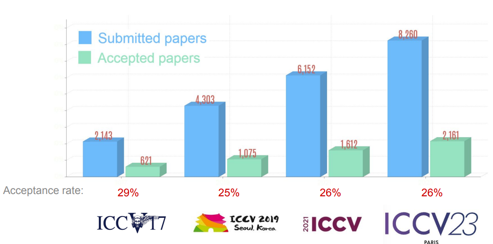
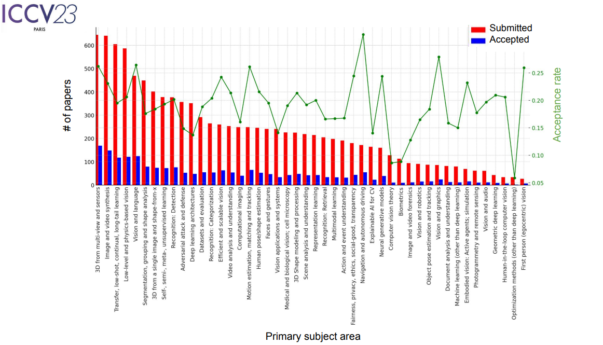

# ICCV23' at Paris

This year, I had a chance to go to the ICCV 2023, which is a top-tier International Conference in Computer Vision (after CVPR). The event was held at Paris from October 2nd to October 6th. Here is some of my thoughts about the conference.

* In my view, the conference was very well organised from catering to keynote talks. The venue was the Paris Convention Centre, which is big enough to host an event like this. The facility is very spacious, modern, and accessible via metro, no complaint about the place. Conference participants were served with breakfast, juice, and coffee throughout five days of the conference - I absolutely love this generous offer. The reception on Wednesday evening is a weak point, where there was only an apéro, which might be not a common sense in many Asian cultures. I didn't expect it to be exceptional, since it is common in any international event in which accommodating the appetite for all international guests from different cultures and religions is no easy task.

* The event began with a series of workshops and tutorials organized in 2 days ranging from fondation models [(link)](https://sites.google.com/view/iccv-mmfm/program), Low-bit Quantization [(link)](https://sites.google.com/view/lbqnn-iccv-23/schedule) (if you'd ever heard about running a ChatGPT, or Lamma 7B models on your own laptop, this is about it), OpenMMlab [(link)](), to BioImage Computing [(link)](https://www.bioimagecomputing.com/). The main event took place on Wednesday. The calendar were fully packed within 3 days. For me, it was *impossible* to see all poster and oral presentations. My advise for first time goers is to do research in advance, only choose topics that are in your interest in order to see and talk with the authors. Finally, there is a great chance that you would miss some **AMAZING** papers. So DO NOT expect to see everything, keep it easy! Here is some stats extracted from the opening slides.

  

  

* For the content, with more than 2000 conference papers, a diversity of Computer Vision problems in multiple domains ranging from Low-Vision, Robotics to Vision generative AI were discussed. This time the community shifted its attentions towards current trending topics such as Vision-Language models, e.g. CLIP, generative models, e.g. diffusion model. Many papers were inspired with these models in their main problems, e.g. 3D point-cloud based reconstruction, 3D modeling, object recognition, segmentation and analysis.

* Keynote speakers this year were two researchers Dorsa Sadigh and Pushmeet Kohli from Google DeepMind (I wonder whether this is the reason we have Google DeepMind as a Platium sponsor)

My final thought is the event like this would immensely generate food of your thought.